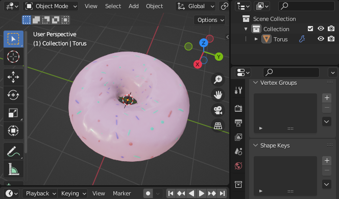
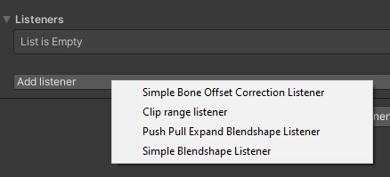
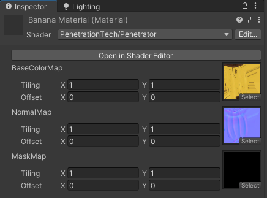

 This repo contains nsfw code as examples. If you're under 18 please leave. 

# Unity Penetration Tech

A gpu-based deformation system for mapping penetrators along orifice paths. Does not work on OpenGL (Due to lack of SSBO in vertex, and cannot dynamically index constant buffers.)

For a write-up on this technology, and some more detailed examples-- see [here](https://koboldkare.com/penetrationtech.php)

# Features

* Advanced Catmull-rom skinning system.
  - Arbitrary soft turns and bends!
  - Allows for all-the-way-through deformations.
  - GPU powered skinning, its very fast!
* GPU cross-sectional girth and offset analysis.
  - Abuses GPU rasterization to analyze the shape of penetrators. Its very fast!
  - Analytical push/tug forces, computed from the derivative of the girth map.
  - Approximates offsets needed to ensure things line up.
* Simple cginc for easy custom shader creation.
  - Also includes Amplify Shader Editor function nodes for easy drag-and-drop support.
  - Can be used in Shader Graph as well, though this is not recommended as Shader Graph is currently buggy.
* Penetration event listeners, for both orifices and penetrators.
  - Easily create custom listeners to detect particular things.
  - Play custom sound effects, trigger animations, apply forces, etc.
* Works entirely within the editor
  - Work with and adjust animations while previewing exactly how the penetrators and penetrables will react.

# Installation

First, install the dependency: `https://github.com/TextusGames/UnitySerializedReferenceUI.git` as a package using the package manager.

Then add `https://github.com/naelstrof/UnityPenetrationTech.git#upm` as a package using the package manager.

Or if that doesn't work, add it to the manifest.json like so.

```
{
  "dependencies": {
    "com.textus-games.serialized-reference-ui": "https://github.com/TextusGames/UnitySerializedReferenceUI.git",
    "com.naelstrof.penetrationtech": "https://github.com/naelstrof/PenetrationTech.git#upm",
  }
}
```

# Quick-Start guide (Penetrable)

---

This guide is for someone who has a model, and some blender experience.
Lets say we have a model we want to penetrate, like a donut!



While this could possibly deform well with procedural deformations, it's more common to manually author the deformations. There's two kind of deformations that PenetrationTech requires: Offset, and girth.

1. Girth deformations can be supported with a blendshape!
 For this donut, we only have to worry about a single cross-section of a deformation,
 for more complicated set ups you might need a chain of blendshapes.

https://user-images.githubusercontent.com/1131571/170908291-dc14856f-fcc2-4b3c-afc4-7c629dffb044.mp4

2. Offset deformations must be supported with a bone, this is to correct for off-center or bumpy penetrators.
 Don't worry about the orientation of the bone, just make sure its somewhat in the center.

https://user-images.githubusercontent.com/1131571/170908346-6d7fa57d-bf6e-4c63-ac50-668e9729c847.mp4

3. Done! That's all the model requirements, export it to Unity as an FBX (or save as a .blend).

Now we can use the model within Unity.

4. Add the *Penetrable* Monobehaviour to an object.
5. Add Empty transforms to represent the path the penetrator will follow, these can be parented to deform with the mesh.
 For this donut, we want to avoid using the *Offset Correction bone*, or a child of it, to prevent feed-back loops.

 

6. Add listeners, depending on the kind of mesh, in order to have the mesh react.
 For the donut, we will use a *Simple Blendshape Listener*, which will trigger the blendshape we set up.



7. Correct errors that appear at the top of the inspector, each listener has its own requirements to run properly.
 In this case, *Simple Blendshape Listener* needs a target mesh, a blendshape,
 and an *Offset Correction bone* to deal with off-center penetrations.


8. Now we need to manually trigger our blendshape to set up the girth variable of the *Simple Blendshape Listener*.

https://user-images.githubusercontent.com/1131571/170908381-ae278b43-7663-4a0a-8da8-72cf7ac61345.mp4

9. Now you can test the model using another penetrator in the scene by enabling *Auto penetrate* on the penetrator.


https://user-images.githubusercontent.com/1131571/170908409-59c472bf-8078-4207-b6a6-4c3df92b1cd7.mp4


# Model guide (Penetrator)

---

This guide is for someone who has a model that represents a penetrator. Lets say we have a banana!


There's two requirements for penetrators: It must have a transform at the center of its base (either a bone or the origin), and it must be straight.
Our banana in this case doesn't meet either requirement, so lets fix that!

1. Straighten the penetrator, no curves allowed! This is because girth analysis happens along one axis.
Don't worry about how funny it looks, we can re-introduce the curve later within Unity.
Ensure that this shape is the "basis shape", as blendshapes aren't supported in the girth analysis (yet).

https://user-images.githubusercontent.com/1131571/170908526-43bb1a89-e95d-4ba4-9892-de99a49ce632.mp4

2. Ensure that the bone, or origin, is at the center of the base of the penetrator. 
For the banana, we just need to use the `Set Origin to 3D Cursor` command since the banana isn't on an armature.
It's helpful to have the penetrator go along a cardinal axis, though this isn't required.
3. Done! That's all that needs to be done for a penetrator to support the tech properly.

Now we can use the model within Unity.

4. Add a *Penetrator* Monobehaviour to the gameobject, then start fixing the errors at the top of the inspector.


5. Once all the errors are fixed, the renderer is now receiving deformation data. But there's no material to receive it!
Lets quickly create one, just make sure it uses a shader that supports the deformation data, like `PenetrationTech/Penetrator`.



6. Applying that to our model, we'll see that its broken/invisible!

This is due to our axis being set up incorrectly, and is easy to fix.
Simply change the forward axis (the blue dotted line) in the same direction of the penetrator,
then flip the Right or Up axis if it ends up inside-out.

https://user-images.githubusercontent.com/1131571/170908495-ba665dd2-fc0c-4f0a-bc07-ed74909a3d18.mp4

7. Now that the banana is correctly rendering, and the girth display (white circles) are displaying correctly
we can reintroduce the curve with the *Tip Target* option like so.
 
https://user-images.githubusercontent.com/1131571/170908464-03938228-d324-4479-abd4-f541d7ac3ef5.mp4

8. Finally enable Auto-Penetrate, or specify a penetrable, and it should start working!

https://user-images.githubusercontent.com/1131571/170908409-59c472bf-8078-4207-b6a6-4c3df92b1cd7.mp4

## Need help?

---

Many things were not covered here, if you need help with this technology please contact me! I'd love to help.
